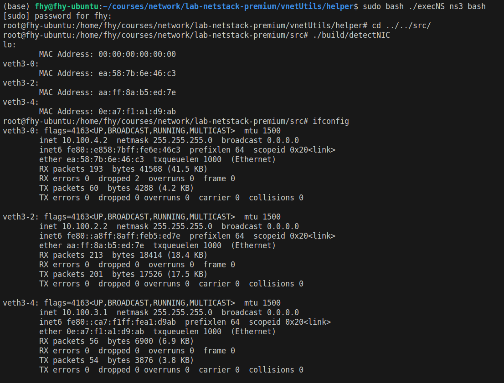
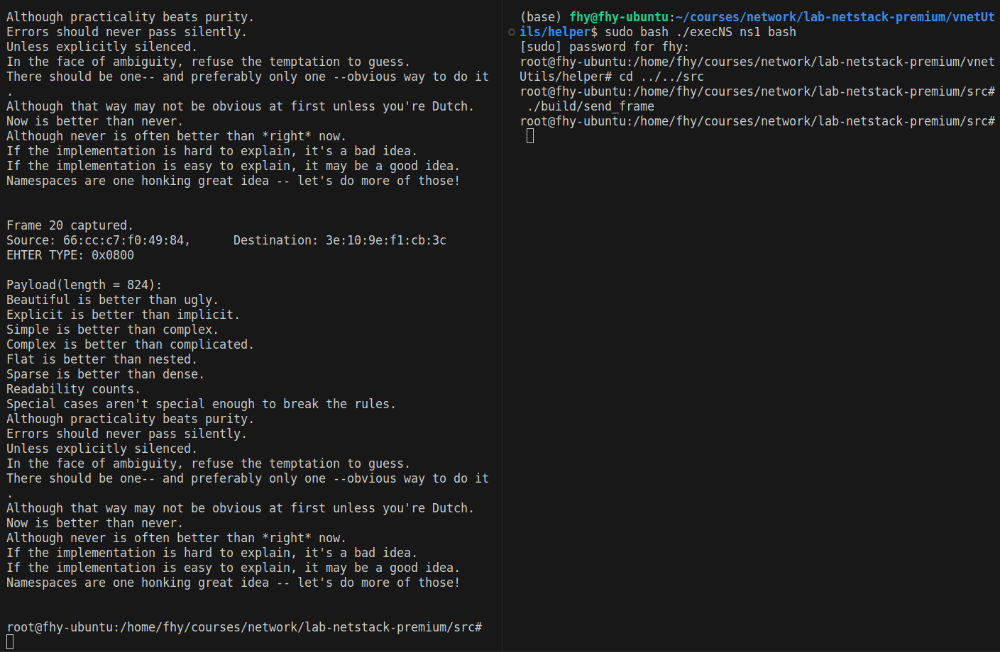
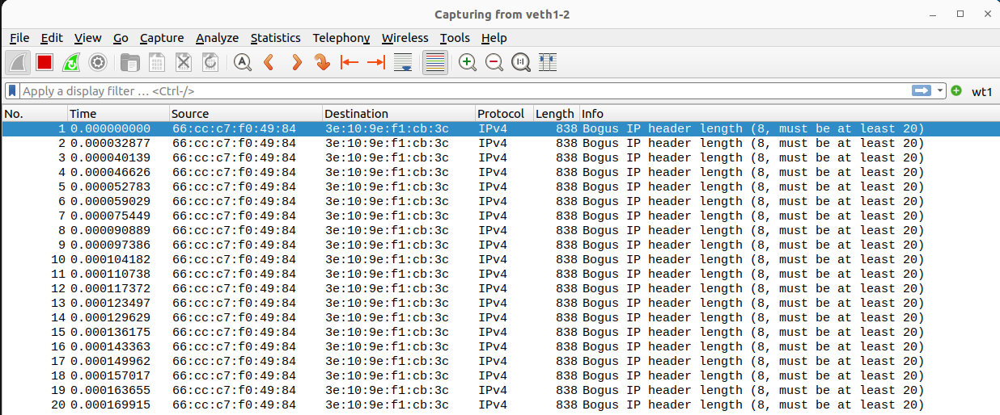
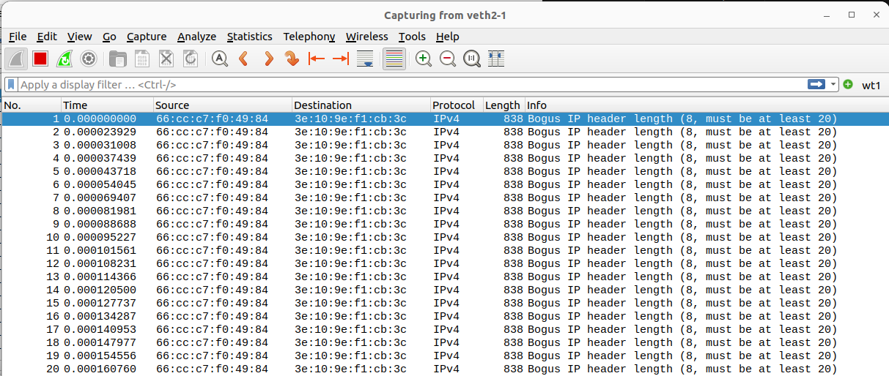

# Lab 1: Link-layer

## Writing Task 1 (WT1)

1. 827 in total.
2. `ff:ff:ff:ff:ff:ff`. This is a special address reserved for broadcasting.
3. 0x15.

## Programming Task 1 & 2 (PT1 & PT2)

```
-src
--ethernet
---device_manager.h/device_manager.cpp
-----DeviceManager::addDevice
-----DeviceManager::findDevice
-----DeviceManager::sendFrame
-----DeviceManager::setFrameReceiveCallback
---device.h/device.cpp
-----Device::sendFrame
-----Device::setFrameReceiveCallback
```

## Checkpoint 1 (CP1)

I created the same virtual network described in vnetUtils.

```
ns1 -- ns2 -- ns3 -- ns4
               |
              ns0
```

My device manager only stores the names of devices that have MAC addresses, since we are implementing Ethernet II. File `src/tests/lab1-link-layer/detectNIC.cpp` lists all those network interfaces. If I run `detectNIC` and `ifconfig` in ns3, the result is as follows:

We can see it shows correct network interfaces, except that it has an extra loopback interface.

## Checkpoint 2 (CP2)

`src/tests/lab1-link-layer/send_frame.cpp` is used for sending frames and `src/tests/lab1-link-layer/receive_frame.cpp` is used for receiving frames. They will finally call `Device::sendFrame` and `Device::capNext` seperately. `Device::sendFrame` uses `pcap_sendpacket` to inject frames and `Device::capNext` uses `pcap_next` to capture frames. 

I ran `receive_frame` in ns2 and waited for frames at veth2-1. Then I ran `send_frame` and sent 20 frames from veth1-2. All 20 frames were received and the contents were correct.





