# Lab2: Network-layer


## Writing Task 2 (WT2)

1. Target MAC address.
2. 6 IPv4 packets.
3. IPv4: 20 bytes; IPv6: 40 bytes.


## Programming Task 3 (PT3)

```
-src
--ip
---ip.h
-----NetworkLayer::sendIPPacket
-----NetworkLayer::callBack
-----NetworkLayer::setIPPacketReceiveCallback
-----NetworkLayer::setRoutingTable
```


## Writing Task 3 (WT3)

I used an algorithm similar to ARP. In the virtual network, an Ethernet is always two devices with a link. So in my implementation, the destination MAC address is always the MAC address of the other end of the link. At regular intervals, the link layer sends  an ARP packet from every devices and store devices' destination MAC addresses on receiving request packets or reply packets.


## Writing Task 4 (WT4)

I used link state routing algorithm. I'll describe it in 5 steps.

1. **Find its neighbors.** At regular intervals, the network layer sends a packet, called HELLO in my implementation from every devices. If the neighbor is alive and successfully receives HELLO, it will send a HELLO packet back to inform the sender it's alive. No matter the HELLO packet is request or reply, the host who receives it will update its link state, which means the ID of the neighbor and the distance to it.
    **Corner cases here: **

    1. Each host's ID must be globally unique. 
        1. The value of `IP & mask` is the same in an Ethernet. So I can't use this value as the ID of a host. But I didn't find a function that gives the complete IP addresses in libpcap. `pcap_lookupnet()` can only `IP & mask`. So I use  `getifaddrs` to get IP addresses instead. 
        2. One host is possible to have several IPv4 addresses. I pick the first one. 

    2. The state of a neighbor contains an age field, which decreases at regular intervals. So if any neighbor of a host crashes and send HELLO packets, the information of the neighbor the host stores will be discarded, believing that it has already broken down. If the neighbor wakes up again, the host will detect that, for sure.

2. **Set the cost of each link.** I set the cost of every link to 1 for simplicity.

3. **Construct link state packet.** A link state packet contains the following information:
   * The sequence number and age of the packet. 
   * All of the host's IP addresses and subnet masks. 
   * All of its neighbors' IDs and the distances to the neighbors.

   In my implementation, a link state packet is always constructed when a host wants to send it.

4. **Distribute link state packets.** I used the flooding algorithm to distribute link state packets. Every link state packet has a sequence number and a host who receives a packet only stores and forwards the packet that has larger seq number than that of the packet previously received.
     **Corner cases here: ** 

     1. Sequence number has 32 bits so it's big enough to use.
     2. If a router or host crashes and reboots, the sequence number will begin with 0. These packets with small seqs will be discarded. I use an age field to solve the problem. If a host doesn't receive a new packet with larger seq number or update its stored link state packets for a while, the stored packet will be discarded and newly receiving packets with smaller seq can be used.

5. **Calculate new routes.** Every routes runs Dijkstra algorithm to compute the shortest paths and updates its routing table at regular intervals.
  **Corner cases here:**

  * When receiving and sending packets, routers will use the routing table. In my implementation, I use two threads separately deals with receiving packets and sending ARP/HELLO/LinkState packets. So I made use of some mutexes to protect routing table.
  * If the destination host is in the same Ethernet with the source host when updating the routing table, I decide to set the IP address field to the full IP address and netmask to `255.255.255.255`. This way, I can accurately determine which is the target host. Moreover, it complies with the "longest prefix matching" rule.


## Checkpoint 3 (CP3)

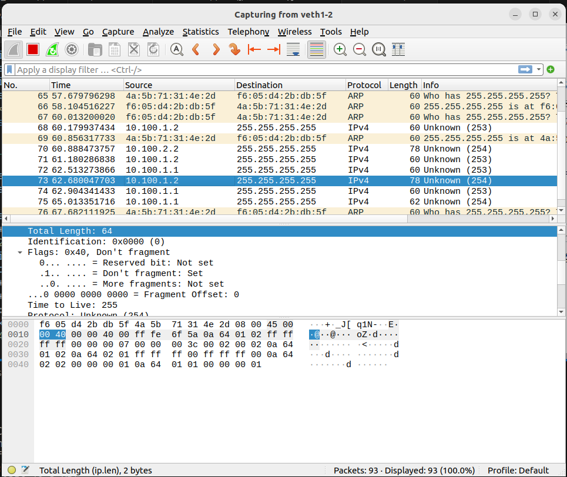

```
0000 | f6 05 d4 2b db 5f 4a 5b   71 31 4e 2d 08 00 45 00
0010 | 00 40 00 00 40 00 ff fe   6f 5a 0a 64 01 02 ff ff
0020 | ff ff 00 00 00 07 00 00   00 3c 00 02 00 02 0a 64
0030 | 01 02 0a 64 02 01 ff ff   ff 00 ff ff ff 00 0a 64
0040 | 02 02 00 00 00 01 0a 64   01 01 00 00 00 00 01
```

This is a IP packet used by my implementation to exchange information in link state routing algorithm.

* The first 14 bytes is Ethernet header
  * The first 6 bytes is the MAC address of the destination in the Ethernet.
  * The second 6 bytes is the MAC address of the destination in the Ethernet.
  * The last 2 byte is 0x0800, and it indicates that the frame contains an IPv4 datagram.
* The following 20 bytes is Internet datagram header.
  * The first byte is 0x45. The first 4 bits of the byte is 0100 which means the version of the header is version 4. The following 4 bits is 0101, and it mean the length of the header is 5 * 4 = 20 bytes.
  * The second byte is the field of Type of Service. I set it to the default value 0x00.
  * The third and fourth bytes is 0x0030. It means the total length of the IPv4 datagram is 48 bytes.
  * 5 to 6 bytes is 0x0000, the identifier of the packet, which is assigned by the sender to aid assembling the fragments of a datagram. And I didn't implement fragmentation, so that's always 0x0000.
  * 7 to 8 bytes is 0x4000. The first bit is reserved, must be zero. The second bit is 1, and it means the datagram can't be fragmented. The third bit is 0, meaning there's no more fragment. The following 13 bits is 0000000000000, indicating this packet contains the first fragment of the datagram.
  * The 9th byte is 0xff. It means the packet has 255 hops to live.
  * The 10th byte is 0xfe. According to RFC 3692, it is used for experimenting and testing.
  * The following 2 bytes is checksum of the header.
  * The following 4 bytes is the source IPv4 address of the packet.
  * The last 4 bytes is the destination IPv4 address of the packet. This data packet is used for distributing link state information. I used a flooding algorithm, so I set this value to 255.255.255.255.
* The following 28 bytes are used for distributing link state information.
  * The first 4 bytes is 0x00000007 which means this is the 8th link state packet the sender sends.
  * The second 4 bytes is 0x0000003c which means this packet has 60 seconds to live on arrival.
  * The next 2 bytes is 0x0002 which means the sender has two (IPv4 address, subnet mask) pairs.
  * The next 2 bytes is 0x0002 which means the sender has two neighbors.
  * The following 16 bytes store 2 IP addresses and 2 subnet masks.
  * The following 16 bytes store 2 (neighbor ID, distance) pairs. Neighbor ID is one the host's IP addresses. Distance is always 1 in my implementation.


## Checkpoint 4 (CP4)

I'll print the routing table once the host updates it.

IPv4 addresses and netmasks:

* ns1: 10.100.1.1/255.255.255.0
* ns2: 10.100.1.2/255.255.255.0; 10.100.2.1/255.255.255.0
* ns3: 10.100.4.2/255.255.255.0; 10.100.2.2/255.255.255.0;  10.100.3.1/255.255.255.0
* ns4: 10.100.3.2/255.255.255.0

(1) ns1 can discover ns4

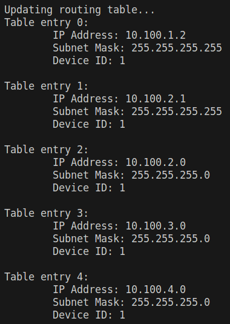

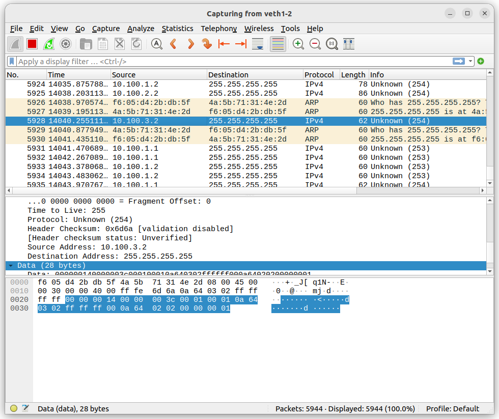

(2) After we disconnect ns2 from the network, ns1 cannot discover ns4. After a while, ns1 can't connect to any other host.

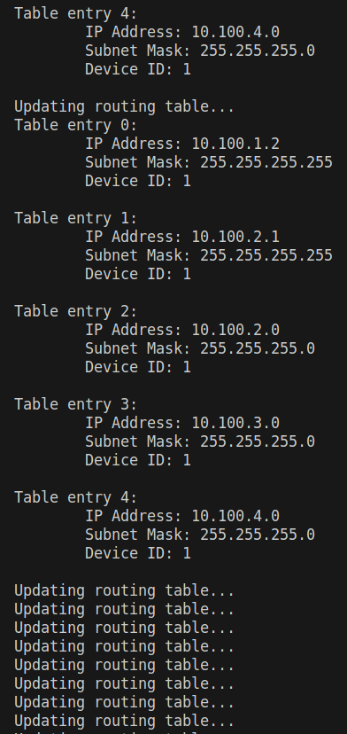

(3) After we connect ns2 to the network again, ns1 can discover ns4. After the ns1 updates its routing table several times, it discovers ns4.

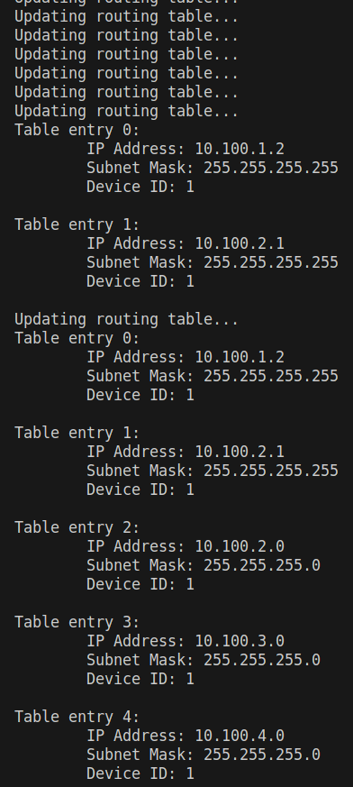


## Checkpoint 5 (CP5)

In my implementation, I set the distance of two hosts who are directly connected to 1.

Because the index of the array depends on the time when link state packets arrives, I use a distance array to show the hosts' names. Index 0 is always the source host. The last column shows the distances to the destinations. 1024 is the maximum length in my implementation. The pictures listed are results printed from ns1 to ns6.

<div align="center">
 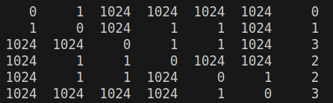
 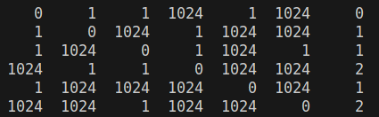
 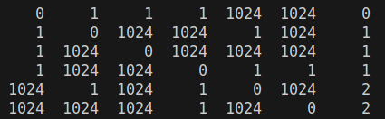
</div>

<div align="center">
 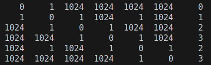
 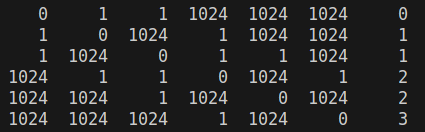
 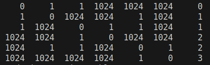
</div>

To make it clearer, the distances between each pair of hosts are showed below.

```
+---+---+---+---+---+---+---+
| \ |ns1|ns2|ns3|ns4|ns5|ns6|
+---+---+---+---+---+---+---+
|ns1| 0 | 1 | 2 | 3 | 2 | 3 |
+---+---+---+---+---+---+---+
|ns2| 1 | 0 | 1 | 2 | 1 | 2 |
+---+---+---+---+---+---+---+
|ns3| 2 | 1 | 0 | 1 | 2 | 1 |
+---+---+---+---+---+---+---+
|ns4| 3 | 2 | 1 | 0 | 3 | 2 |
+---+---+---+---+---+---+---+
|ns5| 2 | 1 | 2 | 3 | 0 | 1 |
+---+---+---+---+---+---+---+
|ns6| 3 | 1 | 1 | 2 | 1 | 0 |
+---+---+---+---+---+---+---+
```

**Disconnect ns5**

<div align="center">
 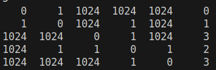
 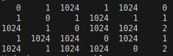
 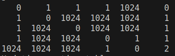
</div>

<div align="center">
 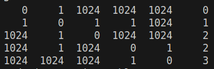
 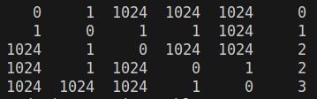
</div>

To make it clearer, the distances between each pair of hosts are showed below.

```
+---+---+---+---+---+---+
| \ |ns1|ns2|ns3|ns4|ns6|
+---+---+---+---+---+---+
|ns1| 0 | 1 | 2 | 3 | 3 |
+---+---+---+---+---+---+
|ns2| 1 | 0 | 1 | 2 | 2 |
+---+---+---+---+---+---+
|ns3| 2 | 1 | 0 | 1 | 1 |
+---+---+---+---+---+---+
|ns4| 3 | 2 | 1 | 0 | 2 |
+---+---+---+---+---+---+
|ns6| 3 | 2 | 1 | 2 | 0 |
+---+---+---+---+---+---+
```


## Checkpoint 6 (CP6)

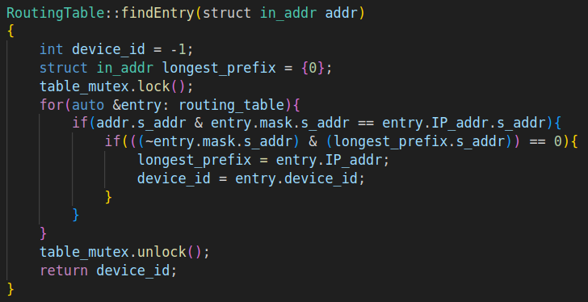

When a router wants to find an entry, it iterate over it routing table and find the longest prefix that matches the destination address.
