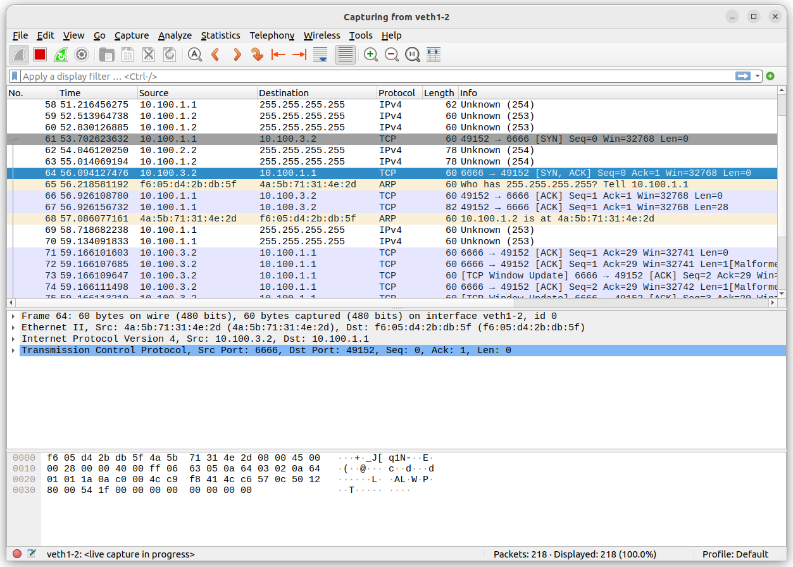
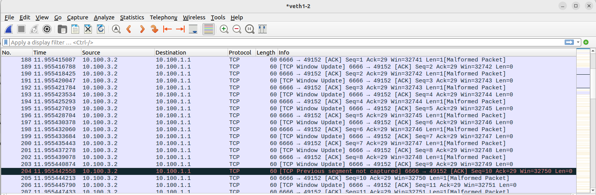
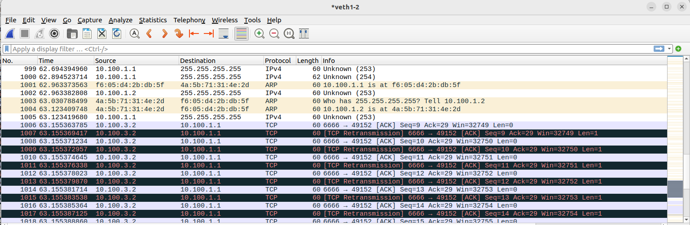
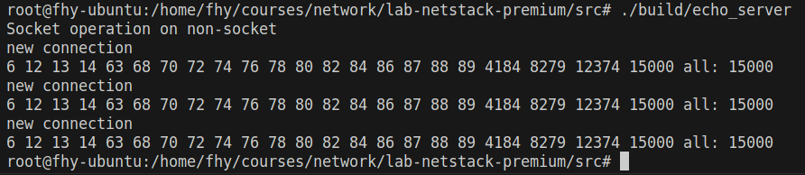
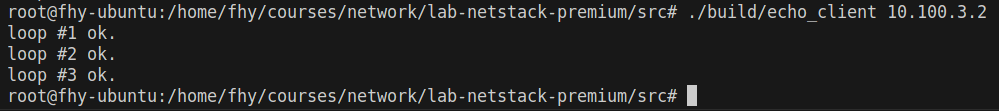
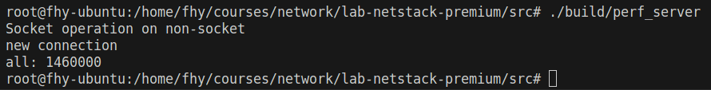
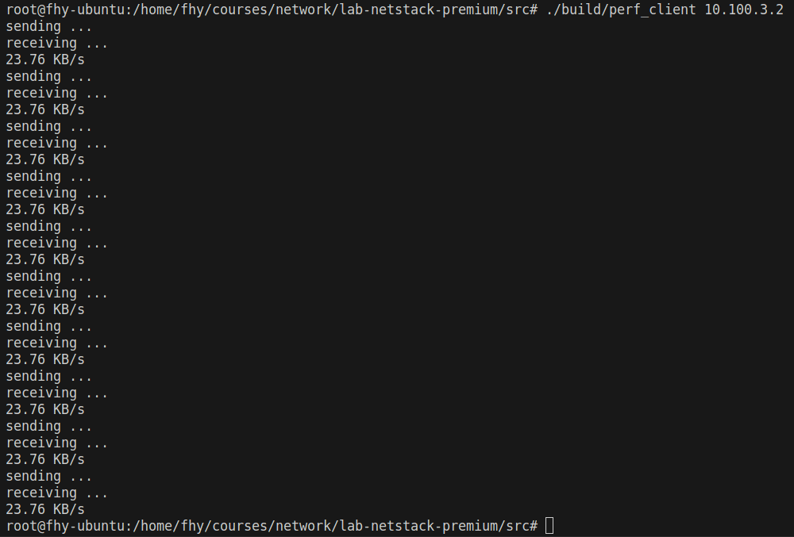

# Lab 3: Transport-layer

## Writing Task 5 (WT5)

1. 2 sessions.  12 segments are included in the first session. 1652 segments are included in the second session.
2. <10.0.0.74, 43120, 115.27.207.221, 80>
   <10.0.0.74, 43122, 115.27.207.221, 80>
3. Size: 43520.  Window field value 85 * window size scaling factor 512 = 43520.

## Programming Task 4 (PT4)

The main implementation is in the following code list.

```
-src
--tcp
---include/tcp.h(tcp.cpp)
-----TransportLayer::_socket
-----TransportLayer::_bind
-----TransportLayer::_listen
-----TransportLayer::_connect
-----TransportLayer::_accept
-----TransportLayer::_read
-----TransportLayer::_write
-----TransportLayer::_close
-----TransportLayer::_getaddrinfo
```

## Checkpoint 7 (CP7)



```
0000 | f6 05 d4 2b db 5f 4a 5b   71 31 4e 2d 08 00 45 00
0010 | 00 28 00 00 40 00 ff 06   63 05 0a 64 03 02 0a 64
0020 | 01 01 1a 0a c0 00 4c c9   f8 41 4c c6 57 0c 50 12
0030 | 80 00 54 1f 00 00 00 00   00 00 00 00
```

This is a [SYN, ACK] segment transmitted from the server to the client. The 35th byte to the 54th byte are the contents of the TCP header.

* The first 2 bytes is 0x1a0a (6666 in decimal), which is the source port number. It is designated by user.

* The following 2 bytes is 0xc000 (49152 in decimal), which is the destination port number. When the client calls `connect` on a socket which hasn't been bound, it sequentially selects an ephemeral port number(49152 - 65535) not in use.

* The 5th to 8th bytes is 0x4cc9f841, which is the sequence number. This is the 0th sequence number of the server. It is generated based on the server's local time.

* The 9th to 12th bytes is 0x4cc6570c, which is the acknowledgement number. It is one greater than the sequence number of SYN received by server.

* The 13th byte is 0x50. And the most significant 4 bits is 0101. It means the TCP header is 5 32-bit words (20 bytes) long. The rest 4 bits are reserved and set to 0 by default.

* The 14th byte is 0x12(00010010). The first 2 bits are reserved according to RFC793. The following 6 bits are control bits, which are URG(Urgent Pointer field significant), ACK(Acknowledgment field significant), PSH(Push Function), RST(Reset the connection), SYN(Synchronize sequence numbers), and FIN(No more data from sender) seperately. SYN and ACK are set in the segment.

* The 15th to 16th bytes are 0x8000, which is the window size of the server. It means the server is willing to accept 32768 bytes data beginning with the one indicated in the acknowledgment field .

* The following 2 bytes is checksum of the header.
* The last 2 bytes is the urgent pointer and it set to 0 by me when URG is off.

## Checkpoint 8 (CP8)

I created the same virtual network described in checkpoint 9. In checkpoint 8, the client at ns1 sends a message to the server at ns4 and ns4 sends it back to ns1 byte by byte. (Source files: `client.c` and `server.c` in `src/tests/lab3-transport-layer/`)



In the first picture, we can see that the byte of seq number 9 from the server was lost. In the second picture, we can see that the server retransmitted that byte and some following bytes after a while and they were successfully received by device veth1-2 at ns1.

## Checkpoint 9 (CP9)





Data transmission worked fine and the connections closed successfully. Note that `setsockopt` wasn't implemented so it would fail.

## Checkpoint 10 (CP10)





In the second picture, we can see that the speed is 23.76 KB/s. I guess the reasons why the speed is somewhat low are that there is too much busy waiting in my implementation and the routing table updates too often. 

Note that I changed `perf_client.c` because I thought there was a bug. I added a `close(sockfd)` before `main` returns 0. If there isn't a close, the process exits when main returns, during which all file descriptors are closed. But that is not the case for my implementation, because that won't call `__wrap_close`, so my `read` would suspend. Posix read also suspends because an EOF never comes to the read in the while loop.
